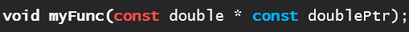

# Week 8

## Pointers
Pointers are simply variables whose values are memory addresses.

### Why Use Pointers?

Because C uses **pass-by-value**, variables are normally copied when passed to
functions which means changes inside the function don’t affect the original
variable.

This is different from languages like Python or Java, where what you pass to a
function is often a **reference to an object**, so changes inside the function
can affect the original data (unless it’s an immutable type).

Without pointers, the only way to share or modify a variable between functions
in C would be to make it **global**, which clutters your program and can lead
to bugs and maintenance headaches.

Pointers solve this by letting you indirectly access the memory by passing a 
**reference** (the actual memory address) instead of a copy. 

### Indirection

Referencing a value through a pointer is called **indirection** because we are 
using the address to find the value rather than directly accessing the value.

When you use a pointer, you are telling the program
*where* to look in memory to find the actual data. This lets different parts
of a program safely share and update the same piece of data without needing
global variables.


<details><summary>More on <strong>Indirection</strong></summary>
<hr>
To understand this concept lets imagine a block of memory as follows:

```nohighlight
+-----------+
|    ???    |  <- Address 0x1000
+-----------+
|    ???    |  <- Address 0x1004
+-----------+
|    ???    |  <- Address 0x1008
+-----------+
|    ???    |  <- Address 0x100C 
+-----------+
```

<small><strong>Note:</strong> In the above, `???` represents unallocated or unknown memory values. 
Memory addresses (e.g., `0x1000`, `0x1004`) are arbitrary and simplified for 
illustration, and assume 4-byte alignment typical for 32-bit systems.</small>

<br>
<br>Suppose we create a variable <code>count</code> and assign it the value of 7.
```c
int count = 7;
```

The program updates memory to place the value 7 at the first available address.

```nohighlight
+-----------+
|     7     |  <- Address 0x1000 (count)
+-----------+
|    ???    |  <- Address 0x1004
+-----------+
|    ???    |  <- Address 0x1008
+-----------+
|    ???    |  <- Address 0x100C 
+-----------+
```

Later we create a pointer to that memory.
```c
int *countPtr = &count;
```

Our memory would now look something like this.

```nohighlight
+-----------+
|     7     |  <- Address 0x1000 (count)
+-----------+
|    ???    |  <- Address 0x1004
+-----------+
|    ???    |  <- Address 0x1008
+-----------+
|   0x1000  |  <- Address 0x100C (countPtr)
+-----------+
```

<ul>
	<li>
	    The variable <code>countPtr</code> holds the value <code>0x1000</code>
	    which is the address of count.
	</li>
	<li>
	    The original variable, <code>count</code> directly references the 
	    value <code>7</code>.
	</li>
	<li>
	    <code>countPtr</code> on the other hand, <strong>indirectly</strong> 
	    references <code>7</code>. It tells you where to find the variable 
	    that holds the value <code>7</code>.
	</li>
</ul>


<hr>
</details>

<br>

## Pointers Primer (video)

Before we get deeper into pointer details, here’s a quick video that explains 
the basics that was shared by a classmate (**SpaceBoy22**) in our class Discord:  

[Bro Code — C Programming Tutorial for Beginners 37 — Pointers](https://www.youtube.com/watch?v=DplxIq0mc_Y)

<iframe width="560" height="315"
    src="https://www.youtube.com/embed/DplxIq0mc_Y"
    frameborder="0"
    allow="accelerometer; autoplay; clipboard-write; encrypted-media; gyroscope; picture-in-picture"
    allowfullscreen>
</iframe>

<br>

### Pointer Size

A pointer is the size of the typical CPU register width in your system.  

For an x86 system, pointers are generally 32-bits wide (4 bytes). For an
x64 computer, pointers are generally 64-bits wide (8 bytes) *unless* you are running
a 32-bit version of an app (which will use 32-bit pointers).

A **bit** is just a single 1 or 0 — so when we say “32 bits” or “64 bits,” we mean a chunk of 1s and 0s stored together.

Larger pointers (64-bit) allow addressing more memory, up to 16 exabytes 
theoretically, compared to 4 GB for 32-bit pointers.

<details>
  <summary>More on <strong>registers</strong></summary>
  <hr>
  <p>A <strong>register</strong> is a tiny, extremely fast storage location built right into 
  the CPU. On modern 64-bit CPUs, each register holds exactly 64 bits (8 bytes).</p>

  <p>The CPU uses these registers to:</p>

  <ul>
    <li>Hold operands for ALU operations (arithmetic, bitwise/logical, comparison & conditionals, etc.)</li>
    <li>Store intermediate results</li>
    <li>Keep track of instruction pointers and flags</li>
  </ul>

  <p>Behind the scenes, the ALU takes inputs from CPU registers, performs one of 
  its many operations on those values in a single clock cycle, then writes the result 
  (and status flags like zero or carry) back into registers.</p>

  <p>Because pointers need to reference any addressable location in memory, their
  size matches the register width.</p>

  <ul>
    <li>On a 32-bit system you get 32-bit (4 byte) pointers; on a 64-bit system you get 
    64-bit (8 byte) pointers — <strong><em>unless</em></strong> you’re running a 32-bit
    <strong>app</strong> on a 64-bit system, which will still use 32-bit pointers.</li>
  </ul>
  <hr>
</details>
<br>

## Declaring a Pointer
To distinguish between a pointer and a regular variable, we use `*` to indicate
to the compiler that the variable is a pointer.
```c
int *countPtr;
```

This is read as "countPtr is a pointer to an int".

It can be helpful to name a pointer in a way that makes it clear it is a pointer
to the programmer such as ending the variable name with `Ptr`.

### **Note:** Pointer Declaration Syntax Variations
There are several valid ways to write a pointer declaration, depending on where you place the `*`:

```c
int *countPtr;  // * touches the name, emphasizing the name is a pointer
int* countPtr;  // * touches the type, emphasizing the pointer type
int * countPtr; // * is between type and name, neutral style
```

All three are equivalent to the compiler, as whitespace around * is ignored. 

However, the choice of style often depends on team coding standards or personal
preference. 

For example, `int* countPtr;` highlights that the type is a 
pointer-to-int.
<br>Whereas `int *countPtr;` emphasizes that `*countPtr` is the pointer 
variable. 

Be cautious when declaring multiple variables in a single line, as 
the `*` placement can lead to confusion (see below).


### **Note:** Avoiding Ambiguity in Pointer Declarations

When declaring multiple variables, it’s best to split them over multiple lines.

For example, consider the following code, which creates one pointer and one regular variable:

```c
int *countPtr, count;
```

This can be ambiguous, especially with the alternate syntax:

```c
int* countPtr, count;
```

Or:

```c
int * countPtr, count;
```

This can make it look like both variables are pointers.

To avoid ambiguity, split declarations over multiple lines:
```c
int* countPtr;
int count;
```

## Initializing a Pointer
When we define a pointer we should always initialize it with some value, even if
that value is `NULL`. 
```c
int *countPtr = NULL;
```

Note we can also use `0` in place of `NULL` since `NULL` refers to address `0`. 

```c
int *countPtr = 0;
```

However, in practice it is best to be explicit about it being `NULL`.


## The Address (`&`) Operator
The unary *address operator* `&` returns the address of its operand.

```c
int y = 5;
int *yPtr = &y;
```

We use the `&y` to assign the ***address*** of `y` to `yPtr`.

## The Indirection/Dereferencing (`*`) Operator
The *dereferencing operator* `*` allows us to follow a pointer to access the value that 
it points to.
```c
printf("%d", *yPtr); // prints 5
```

Dereferencing an uninitialized or NULL pointer (e.g., `int *ptr; printf("%d", *ptr);`)
causes **undefined behavior**, often leading to program crashes. 

Always ensure a pointer points to a valid memory address before dereferencing.

### Note: Dual Meanings of `*`
In C `*` has different meanings depending on context:

 - In a ***declaration***, it means the variable is a pointer to the given type.
 - In an ***expression***, it means *dereference* the pointer (access the value at the address).

```c
int x = 10;
int *ptr = &x;  // * in declaration: ptr is a pointer
printf("%d", *ptr);  // * in expression: dereference to get 10
```

## `const` with Pointers

***You will be tested on this!***

`const` can be used in two ways with pointers in a function:



1. The first <font color="red"><strong>const</strong></font> means you cannot change the value being
pointed to (`*dPtr` is read-only).

2. The second <font color="blue"><strong>const</strong></font> means you cannot change the pointer itself (you can’t make 
`dPtr` point somewhere else).

Bob recommended remembering it this way:

 - if `const` is beside the **type** it affects the *data*
    - therefore you can't change the data that the pointer dereferences.
 - if `const` is beside the **pointer** it affects the *pointer*
    - therefore you can't make this pointer point to a different address.

<hr>
**Note:**
This second <font color="blue"><strong>const</strong></font> must come after the `*` but before the variable name.

Writing `const double const *dPtr`, where the second const is before the `*`
is ***not*** equivalent to the original example; 
both uses of `const` in this version apply to the *data* and not to the pointer.
<hr>


## Incrementing a Pointer

If you increment a pointer (`++myPtr`), it simply moves to the next address in
memory for that type — so it now points to the “next” item.

If you increment a pointer **inside a function**, only the local copy is changed. 
The original pointer in the caller **still points to the same place** unless 
you pass a pointer-to-pointer.

This means that inside a function, you can use `++` or `--` to loop through
the memory next to the pointer **without losing the original starting point**.
