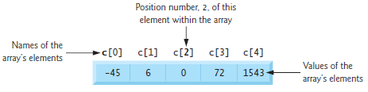

# Week 5

## Arrays
**Arrays** are data structures consisting of related data items of the same type.
More specifically, an array is a group of **elements** of the *same* type stored 
contiguously in memory.




### Accessing Elements of an Array
To access an element we specify the array name followed by a position number in 
`[]`. This position number is also known as a **subscript** or **index**. The index
is 0-based so `my_array[3]` will be the *fourth* element of `my_array`.

### Defining an Array
To define an array, we specify the type of the array followed by the number of elements
that will be in the array in `[]`. For example, `int my_arr[3];` will reserve a space that is 
3 ints wide in memory and assign it the label my_arr. 

In `C` arrays are static entities meaning that they remain the same size 
throughout their lifetimes. That is, they can't be resized.

Note: in general we should use a `#define` statement for the size of an array so that
we can avoid using *magic numbers*

### Looping over an Array.

When looping over an array, it is recommended to use a `size_t` type for the counter control variable.
```c
#include <stdio.h>

int main(void)
{
    for (size_t i = 0; i < 5; ++i)
    {
	n[i] = i;
    }
}
```

### Initializer Lists
We can define an array with an initializer list to set all the elements to specific values.
`int n[5] = {32, 27, 64, 18, 95}` will set `n[0]` to 32, `n[1]` to 27, etc.

The size of the initializer list does not need to be as large as the array. Any elements that are not specified 
will be set to 0.
`int n[5] = {0};` is equivalent to `int n[5] = {0,0,0,0,0}`. 


## Strings
A string in C is an array of char, terminated by a NUL character '\0' (ASCII 0).
As a side note - an array of char does not necessarily need to be a string but a string is *always* and array of char.

There are a few ways to define a string:

```c
// 1. String literal — auto-size, NUL added
char s1[] = "hello";

// 2. Fixed-size array with string literal — NUL added, extra space unused
char s2[10] = "hello";

// 3. Character array with initializer list — must manually add '\0'
char s3[] = { 'h', 'e', 'l', 'l', 'o', '\0' };
```
Note: for s2 style of defining a string, where we define the size we must 
*always* make sure that the size can accommodate the '\0' at the end. 
`char s2[5] = "hello"` would be invalid because all 5 spaces would be used up.

### String Input
When we want to grab input from the user, we can define a fixed size buffer array
to store the string in and then use a size format specifier to make sure we do not
exceed the size of the buffer.

```c
char buf[20];
scanf("%19s", buf); // note that we don't add the & here that we
		// normally do in scanf because buf is an array
		// and is already a pointer
```

## Static vs Automatic Arrays
Recall that static, similar to Java, means that something is only ever initialized
*once* during a program call. Every time its referred to by a function thereafter,
it refers to that *single* instance.

This is in contrast to the default (automatic) array. Every time an automatic array initialized by
a function it is a *new* instance of that array and is destroyed after we exit the function.
```c
static int s_arr[3];  // keeps values between calls - initialized to 0 by default
int a_arr[3];         // new array each time — garbage values until initialized
```

| Type            | Lifetime            | Initialized to          |
|-----------------|---------------------|-------------------------|
| static array    | Entire program      | `0` (by default)        |
| automatic array | Each function call  | Garbage (unless explicit) |


