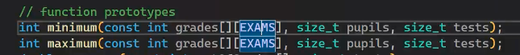
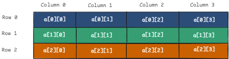
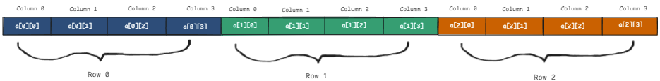

# Week 6

## Passing an Array to a Function
To pass an array as an argument to a function simply use its name without square brackets.
```c 
myFunc(myArr);
```
When we pass an array to a function in C, we are really passing a pointer to the
first element of the array.

This means the function can modify the original array — we are not creating a copy.
That is, we are passing by *reference*.


When we pass an array in to a function which doesn't need to modify it, for example searching an array for max, we can pass it as `const`. 

<br>This is like putting up guard rails to make sure that we don't actually change the array.

## Multi-Dimensional Arrays
Multidimensional arrays are arrays within arrays. The simplest kind is a **2-dimensional array.**

In a 2-dimensional array, the first index is the row and the second is the column.
Think of it like a spreadsheet:



However, memory is only one-dimensional. Therefore, a 2D array is stored like this:



The number of columns determines where each new row starts in memory.
<br>This is because C stores arrays in row-major order — row by row.

We can compute the address of any element in a 2D array with this formula:
```
start_loc + (rowNum * numberOfColumns) + colNum
```

where `start_loc` is the address of the first element of the array.

### Multi-Dimensional Arrays with Initializer Lists
When we initialize a 2d array, we can use additional sets of `{}` to signify rows
```c
int arr[3][3] = {
    {0, 1, 2},
    {3, 4, 5},
    {6, 7, 8}
};
```

But this is just for readability — the underlying memory layout is the same as:

```c
int arr[3][3] = {0,1,2,3,4,5,6,7,8};
```

Both arrays will be identical, but the first is more readable.

### Passing a Multi-Dimensional Array to a Function
When passing a multi-dimensional array to a function, we must explicitly specify
the size of all dimensions except the first.

This is because the compiler needs to know the number of columns to correctly 
calculate where each row starts in memory.

`void printArray(int arr[][3], size_t nRows);`

We do not need to specify the first dimension (number of rows).

### Looping Over Multi Dim Arrays
Bob specifically said do not use variables like `i` or `j` when looping over arrays.

Instead use things like `r`, `c` or `row`, `col` or something else that is similarly
explicit.

```c
for (size_t row = 0; row < 3; ++row)
{
    for (size_t col = 0; col < 4; ++col)
    {
	printf("%d ", arr[row][col]);
    }
    printf("\n");
}
```

## Variable-Length Arrays (VLAs)

A variable-length array is an array whose size is not known at compile time.
It can be created using a runtime value.

```c
int size;
scanf("%d", &size);
int arr[size];
```

However, not all compilers support VLAs. 

**Note:** Bob very specifically said ***don't use VLAs*** in this course.

If needed, dynamic arrays should be created using malloc, calloc, or realloc.
